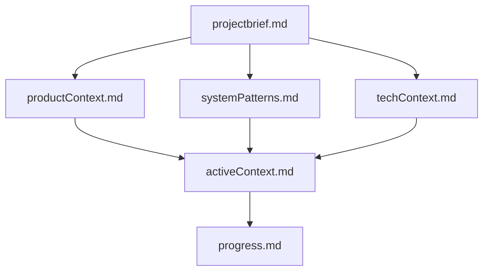

# Memory Bank Skill

This skill maintains durable project context in the `memory-bank/` folder.

## Mental model (hierarchy)

The core files build on each other; treat `projectbrief.md` as the foundation and keep `activeContext.md` / `progress.md` current:



## When to use

Use this skill when the user asks to:

- Run or consume the memory bank
- Update the memory bank
- Summarize current project context / active work focus using the memory bank

Do NOT run this skill automatically for every task unless the user explicitly requests it.

## Scope and rules

- The Memory Bank describes the *project being worked*, not the Command Bank framework itself.
- Only modify files under `memory-bank/` when updating memory.
- Do not modify Command Bank files as part of this skill.

## When to update the Memory Bank

Update the memory bank whenever any of the following occur:

- After implementing significant changes or refactors
- When new project patterns or technical decisions are discovered
- At the end of a sprint, milestone, or major feature
- When context or requirements need clarification
- When the user explicitly requests: “update memory bank” / “consume memory bank”

## Required core files

These files are the “core set” for the memory bank:

- `memory-bank/projectbrief.md`
- `memory-bank/productContext.md`
- `memory-bank/systemPatterns.md`
- `memory-bank/techContext.md`
- `memory-bank/activeContext.md`
- `memory-bank/progress.md`
- `memory-bank/update-log.md`

### What each core file is for

- `projectbrief.md`: The foundation (scope, goals, non-goals). Source of truth.
- `productContext.md`: Why the project exists; problems solved; UX goals.
- `systemPatterns.md`: Architecture + key technical decisions + patterns.
- `techContext.md`: Technologies, setup, constraints, dependencies.
- `activeContext.md`: Current focus, recent changes, next steps, active decisions.
- `progress.md`: What works, what’s left, current status, known issues.
- `update-log.md`: Chronological log of memory updates (what changed and when).

Additional context files may exist in `memory-bank/` (feature specs, notes, etc). Use them only if relevant.

## Consume workflow (read-only)

When asked to *consume* the memory bank:

1. Read all core files listed above.
2. Optionally read additional context files only if they appear relevant to the user’s current request.
3. Output a concise Markdown summary with:
   - **Current project context**
   - **Active work focus**
   - **Recent changes** (based on `activeContext.md` and/or `update-log.md`)
   - **Risks / unknowns** (missing or stale content)
   - **Next steps** (what to do next and which memory files should be updated)

## Update workflow (writes)

When asked to *update* the memory bank:

1. Read all core files.
2. Determine what changed (based on user request, diffs, implementation work just performed).
3. Update only the memory-bank files that need changes. Prefer minimal diffs.
4. Append a new entry to `memory-bank/update-log.md` for every update operation.

If additional non-core files exist under `memory-bank/`, do not blindly rewrite them. Only read/update them if they are clearly relevant to the current request (or the user explicitly asks for a “full memory bank audit”).

### `update-log.md` entry format

Append entries in this format:

```markdown
### YYYY-MM-DD HH:mm UTC
- Updated `activeContext.md` to reflect <what changed>
- Updated `progress.md` to reflect <what changed>
- (Optional initials)
```

## Quality bar

- Keep each memory file tight and scannable.
- Avoid duplicating the same content across multiple files.
- Prefer concrete facts over speculation.
- If the memory bank is missing core files, create them with minimal initial content and clearly mark unknowns.
